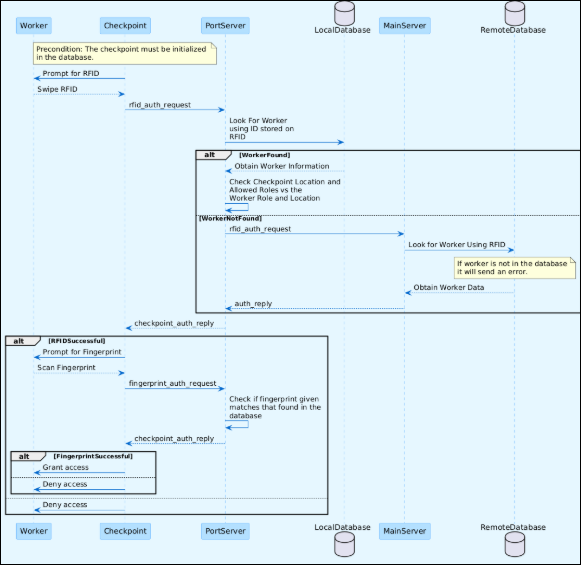
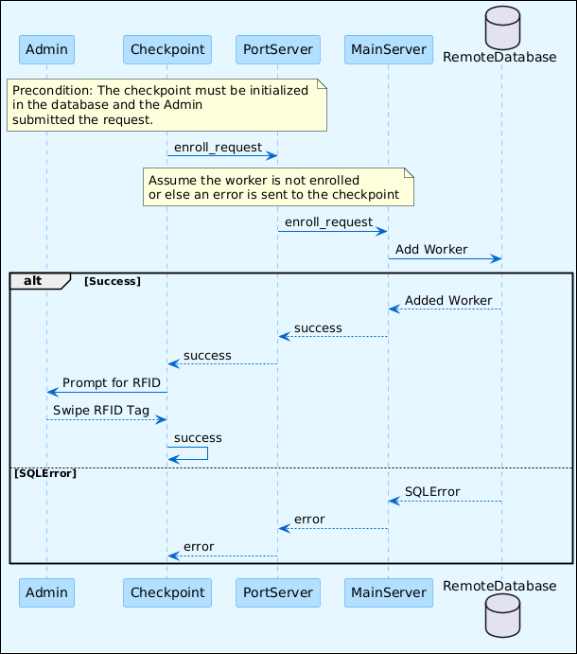

# TWIC Access Control Project

## Requirements Analysis

1. The system must allow a worker past if he/she passes both authentication checks.
2. The system must deny a worker past the checkpoint if he/she fails an authentication check.
3. The system must use two factor authentication.
4. The system must have a fingerprint scanner.
5. The system must use a card for user authentication.
6. A server is needed to host a secure database of workers and their roles in the system.
7. The role of each user should determine their access to certain resources.
8. The biometric data of each registered worker will be stored locally at the port.
9. Data should not be stored in plaintext.
10. The port will keep logs of entries at all checkpoints.
11. Each checkpoint should be configurable to allow access only to those who need it.
12. The system must default to restricting access should an authentication mechanism fail.
13. The server should be able to get entry logs and register new users to each port when needed.
14. The server should be protected by password authentication so only those authorized can use it.

## User Categories

- Server manager: Is responsible for registering new users to ports and can request log data from a port. Has access to the central server.
- Port manager: Is responsible for the logs of all checkpoints and registering new workers to the port. Has access to the port logs and port user data.
- Local worker: Is an employee at their respective port and spends all day working there. Has access to what is needed for their job.
- Ship/train worker: Enters and leaves ports to deliver goods. Has access to enter and leave the port.
- Technician: Maintains the infrastructure of the port. Has access to resources that the port uses to function.
- Janitor/maintenance: Is responsible for maintaining the port. Has access to any part of the port that does not contain sensitive data or risks safety.

## Use Cases

### Authenticating a User At Checkpoint

Brief Description: A worker will need to authenticate himself to gain access to an area on the port.  
There will be two layers of authentication: a biometric scanner (fingerprint sensor) and a card reader.

Primary Actor: Worker

Basic Flow:

1. User scans their card on the card reader.
2. Card is validated by the system.
3. System prompts user to scan fingerprint.
4. User scans their fingerprint.
5. System allows user through the checkpoint.

Alternative Flow 1:

1. User scans their card on the card reader.
2. User is deemed to not have the required role as per the data on the card.
3. System denies user entry through the checkpoint.

Alternative Flow 2:

1. User scans their card on the card reader.
2. Card is validated by the system.
3. System prompts user to scan fingerprint.
4. User scans their fingerprint.
5. The fingerprint read does not match the fingerprint associated with the card.
6. System denies entry through the checkpoint.

### Enrolling a New User

Brief Description: A new worker needs to be given a role to access the areas required. The  
server manager is in charge of adding new users.

Precondition: The server manager is already logged in to the server.

Basic Flow:

1. The server manager collects information (name, birthday, etc) from the new user and creates a profile in the system.
2. The user will specify the ports they wish to be registered to.
3. The server manager decides the role that is to be assigned to the user.
4. The server manager reads the fingerprint from the new user.
5. The fingerprint and other information is added into the system.
6. The server sends the permissions to the required checkpoints.
7. The user gets given a card.

### Updating User Profile

Brief Description: From time to time, user roles and ports will need to be changed. The server  
manager is in charge of this.

Precondition: The server manager is already logged in to the server.

Basic Flow:

1. The server manager will load a user's profile.
2. The server manager will input the desired changes into their UI.
3. The database will be updated with the user's new role/permissions.
4. The server updates the permissions for the required checkpoints.

## Restrictions

1. No cloud databases due to vulnerabilities associated with it.
2. The security of the system should not be based on the secrecy of its design.
