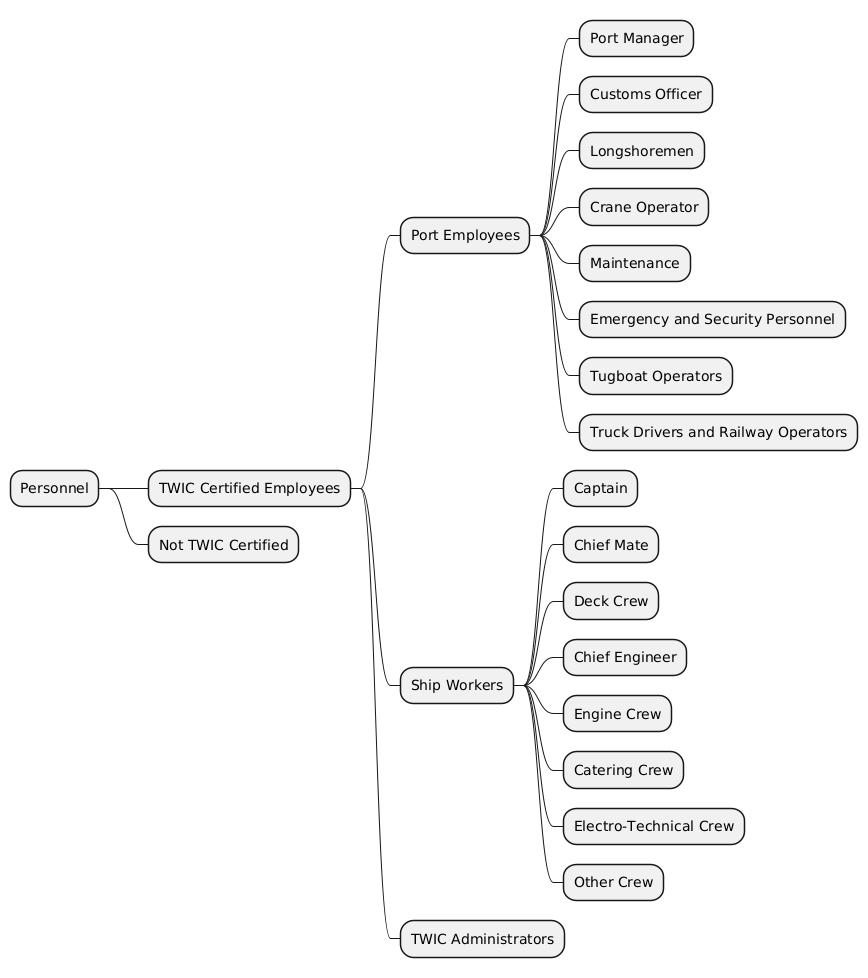
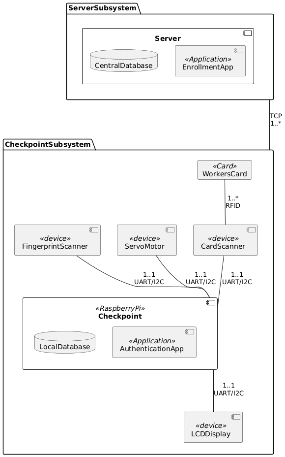

# TWIC Access Control Project

## Requirements Analysis

1. The system must deny a worker past a checkpoint unless he/she passes  
   the two factor authentication (2FA).
2. The system must use 2FA using a fingerprint  
   scanner and a card reader.
3. The system must store the data of each registered user, including biometric  
   data, port of registry and role.
4. The role of each user in the respective port should determine their  
   access through checkpoints.
5. Confidentiality and integrity shall be preserved with worker data,  
   including biometric data, role data and port of registry.
6. The port will keep logs of entries and entry attempts showing the timestamp  
   in UTC, the name and role of the worker, and whether access was granted,  
   at all checkpoints.
7. Each checkpoint should be configurable to allow access only to those who  
   need it.
8. The system should be able to compile entry logs and register new users to  
   each port when needed.
9. The system must be such that only those authorized to change worker roles  
   are able to do so.

## User Categories

> [!IMPORTANT]
> Note that only TWIC administators will be able to manipulate roles, and only  
> TWIC administators and Port Managers will be able to access Port data, with the  
> Port >manager being able to view data for their respective port.

## Use Cases

### Authenticating a User At Checkpoint

Brief Description: A worker will need to authenticate himself to gain access to an area on the port.  
There will be two layers of authentication: a biometric scanner (fingerprint sensor) and a card reader.

Primary Actor: Worker

Basic Flow:

1. User scans their card on the card reader.
2. Card is validated by the system.
3. System prompts user to scan fingerprint.
4. User scans their fingerprint.
5. System allows user through the checkpoint.

Alternative Flow 1:

1. User scans their card on the card reader.
2. User is deemed to not have the required role as per the data on the card.
3. System denies user entry through the checkpoint.

Alternative Flow 2:

1. User scans their card on the card reader.
2. Card is validated by the system.
3. System prompts user to scan fingerprint.
4. User scans their fingerprint.
5. The fingerprint read does not match the fingerprint associated with the card.
6. System denies entry through the checkpoint.

### Enrolling a New User

Brief Description: A new worker needs to be given a role to access the areas required. The  
server manager is in charge of adding new users.

Precondition: The server manager is already logged in to the server.

Basic Flow:

1. The server manager collects information (name, birthday, etc) from the new user and creates a profile in the system.
2. The user will specify the ports they wish to be registered to.
3. The server manager decides the role that is to be assigned to the user.
4. The server manager reads the fingerprint from the new user.
5. The fingerprint and other information is added into the system.
6. The server sends the permissions to the required checkpoints.
7. The user gets given a card.

### Updating User Profile

Brief Description: From time to time, user roles and ports will need to be changed. The server  
manager is in charge of this.

Precondition: The server manager is already logged in to the server.

Basic Flow:

1. The server manager will load a user's profile.
2. The server manager will input the desired changes into their UI.
3. The database will be updated with the user's new role/permissions.
4. The server updates the permissions for the required checkpoints.

## System Architecture

For our TWIC Access Control system, we opted to use a distributed architecture,
rather than a centralized architecture. While a centralized architecture would
work fine for the requirements of the system, the performance would diminish,
due to network traffic and overhead with encrypting and decrypting the data that
can instead be stored locally. Our design would still require some security principles
since worker data will need to be sent to the respective checkpoints when a new
worker is enrolled or if a worker's role and port information is updated. This
design ensures security (i.e. each checkpoint's disk will be encrypted), and the
authentication will be performed locally. This will lower the likelihood of
workers being annoyed with the system, and will increase overall usability. A
totally local system (i.e. each checkpoint has all worker information) would have
the best performance, however, it would get quite costly as each checkpoint would
require a lot of disk space. We believe that this design allows for the best of both
world between a completely localized versus centralized system.

TWIC administrators will be able to manage worker roles and ports, through sufficient
authentication. Two factor authentication will be used to verify that nobody who
is not a TWIC Administrator can manipulate worker role and port information. Additionally
this information cannot be changed at the checkpoint level, it must be done from the
server level.

## Restrictions

1. No cloud databases due to vulnerabilities associated with it.
2. The security of the system should not be based on the secrecy of its design.
