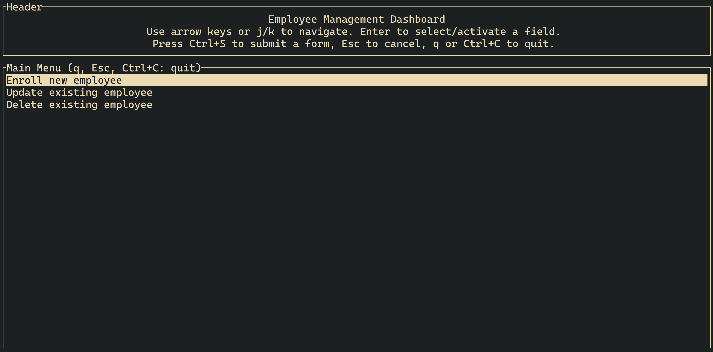

# Checkpoint

## Usage

### Function

There are two types of checkpoints, a normal checkpoint and an admin checkpoint.
The normal checkpoint simply prompts for an employee authentication and an admin
checkpoint opens a user interface for admin level operations once authenticated.

For a normal checkpoint use the authenticate function.

```bash
cargo run "authenticate" [location] [allowed_roles]
```

For an admin checkpoint, use the tui function.

```bash
cargo run "tui" [location] [allowed_roles]
```

The user interface will show up once an admin's RFID card is tapped. From there
an admin can perform enroll new employees, update their credentials, or remove
them from the database.



### Location

The location of the checkpoint is passed in as a command line argument like its
function. For example, you can run a checkpoint that is in Halifax.

```bash
cargo run [function] "Halifax" [allowed_roles]
```

### Allowed Roles

The roles that a checkpoint allows are passed in as a comma-separated list.
For example, a checkpoint that allows managers and workers would be run like this.

```bash
cargo run [function] [location] "Manager,Worker"
```
